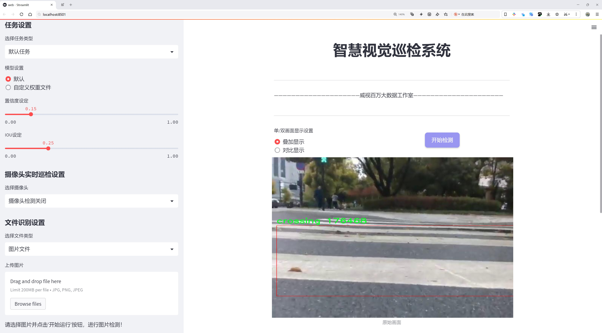
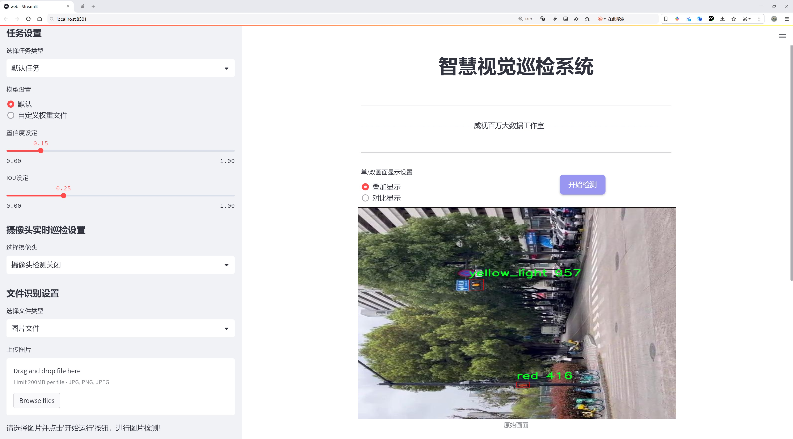
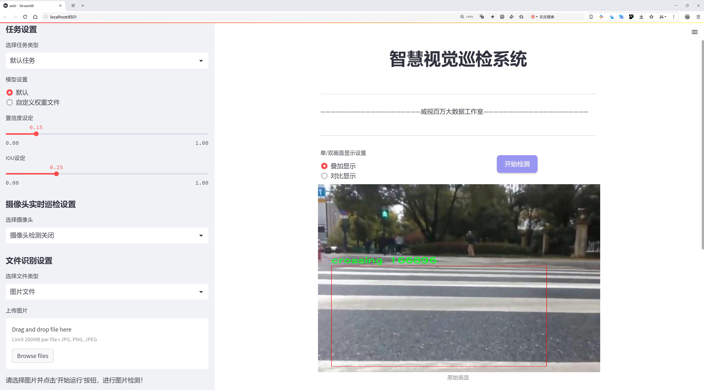
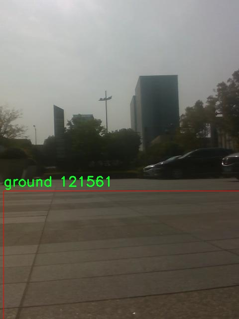
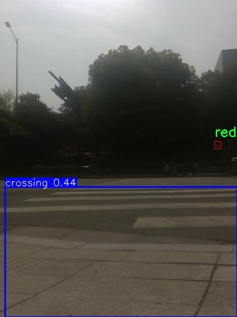
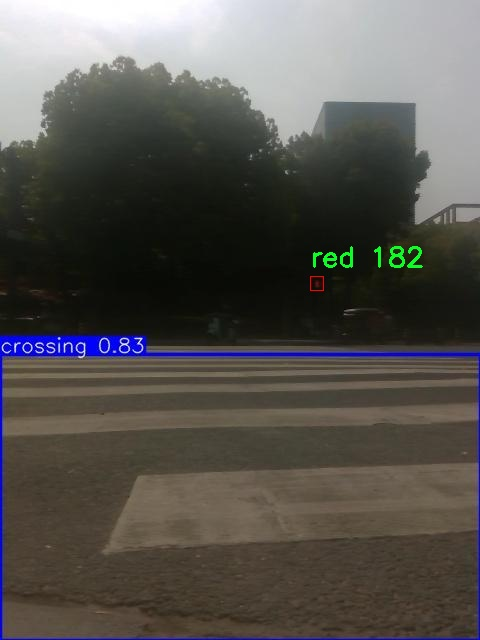
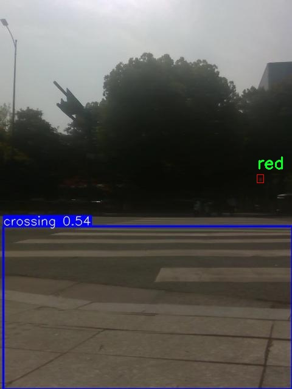
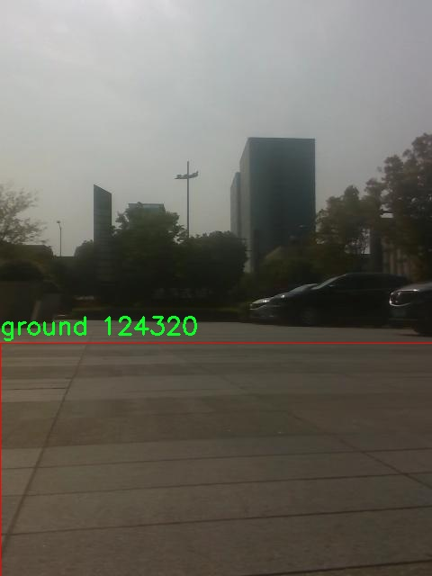
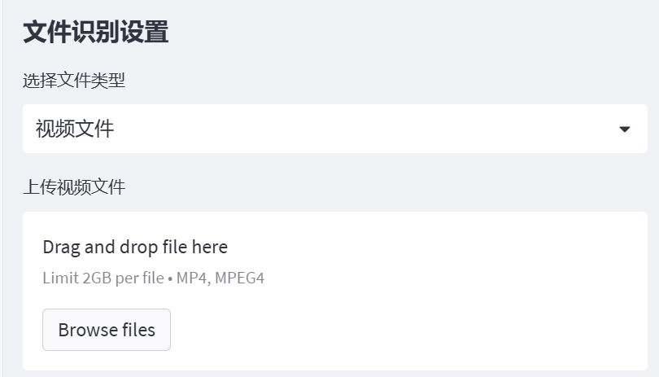

# 交通路面标示信号灯检测系统源码分享
 # [一条龙教学YOLOV8标注好的数据集一键训练_70+全套改进创新点发刊_Web前端展示]

### 1.研究背景与意义

项目参考[AAAI Association for the Advancement of Artificial Intelligence](https://gitee.com/qunmasj/projects)

项目来源[AACV Association for the Advancement of Computer Vision](https://kdocs.cn/l/cszuIiCKVNis)

研究背景与意义

随着城市化进程的加快，交通管理的复杂性日益增加，交通安全问题愈发突出。交通信号灯和路面标示作为交通管理的重要组成部分，直接影响着道路交通的安全与效率。传统的交通信号灯检测方法多依赖于人工巡查和简单的图像处理技术，存在着响应速度慢、准确性低等缺陷。近年来，随着深度学习技术的迅猛发展，基于计算机视觉的交通信号灯检测系统逐渐成为研究热点。YOLO（You Only Look Once）系列模型因其高效的实时检测能力而受到广泛关注，尤其是YOLOv8模型在目标检测任务中展现出更为优越的性能。因此，基于改进YOLOv8的交通路面标示信号灯检测系统的研究具有重要的理论价值和实际意义。

本研究旨在构建一个高效、准确的交通信号灯检测系统，以提高交通管理的智能化水平。我们将利用包含1600张图像的数据集，该数据集涵盖了七个类别的交通标示，包括行人过街标志、绿灯、红灯、黄灯等。这些类别的多样性为模型的训练提供了丰富的样本，有助于提高检测的准确性和鲁棒性。通过对YOLOv8模型的改进，我们将探索如何在复杂的交通环境中，准确识别和分类不同的交通信号灯和路面标示，从而为智能交通系统的实现奠定基础。

在技术层面，YOLOv8模型的改进将包括网络结构的优化、损失函数的调整以及数据增强技术的应用。这些改进旨在提升模型对不同光照、天气条件及视角变化的适应能力，从而在实际应用中实现更高的检测精度。此外，我们还将结合迁移学习的思想，利用预训练模型加速训练过程，提高模型的收敛速度和性能表现。

从社会意义上看，交通信号灯检测系统的有效性将直接影响到交通安全和城市交通管理的效率。通过实现对交通信号灯的自动检测和识别，可以大幅度降低交通事故的发生率，保障行人和驾驶员的安全。同时，该系统的应用也将为智能交通系统的建设提供技术支持，推动城市交通管理向智能化、自动化的方向发展。

综上所述，基于改进YOLOv8的交通路面标示信号灯检测系统的研究，不仅具有重要的学术价值，也为解决实际交通管理问题提供了有效的技术手段。通过本研究的深入，期望能够为未来的智能交通系统提供坚实的基础，促进交通安全和城市可持续发展。

### 2.图片演示







##### 注意：由于此博客编辑较早，上面“2.图片演示”和“3.视频演示”展示的系统图片或者视频可能为老版本，新版本在老版本的基础上升级如下：（实际效果以升级的新版本为准）

  （1）适配了YOLOV8的“目标检测”模型和“实例分割”模型，通过加载相应的权重（.pt）文件即可自适应加载模型。

  （2）支持“图片识别”、“视频识别”、“摄像头实时识别”三种识别模式。

  （3）支持“图片识别”、“视频识别”、“摄像头实时识别”三种识别结果保存导出，解决手动导出（容易卡顿出现爆内存）存在的问题，识别完自动保存结果并导出到tempDir中。

  （4）支持Web前端系统中的标题、背景图等自定义修改，后面提供修改教程。

  另外本项目提供训练的数据集和训练教程,暂不提供权重文件（best.pt）,需要您按照教程进行训练后实现图片演示和Web前端界面演示的效果。

### 3.视频演示

[3.1 视频演示](https://www.bilibili.com/video/BV1xx2GYqERU/)

### 4.数据集信息展示

##### 4.1 本项目数据集详细数据（类别数＆类别名）

nc: 7
names: ['crossing', 'green', 'green_light', 'ground', 'red', 'red_light', 'yellow_light']


##### 4.2 本项目数据集信息介绍

数据集信息展示

在现代交通管理系统中，准确识别交通路面标示和信号灯的能力至关重要。为此，我们构建了一个名为“cross&tl”的数据集，旨在为改进YOLOv8的交通路面标示信号灯检测系统提供高质量的训练数据。该数据集专注于七个关键类别，涵盖了交通标示和信号灯的多样性，确保系统能够在各种环境和条件下进行有效的检测与识别。

“cross&tl”数据集包含七个类别，分别是：行人过街标志（crossing）、绿色信号灯（green）、绿色灯光（green_light）、路面（ground）、红色信号灯（red）、红色灯光（red_light）以及黄色灯光（yellow_light）。这些类别不仅反映了交通信号灯的状态，还包括了与行人安全相关的交通标示，确保在复杂的交通场景中，系统能够综合考虑各种因素。

在数据集的构建过程中，我们特别注重数据的多样性和真实性。数据来源于多个城市的实际交通场景，涵盖了不同的天气条件、时间段以及交通流量。这种多样性使得数据集能够更好地模拟现实世界中的复杂情况，从而提高YOLOv8模型在实际应用中的鲁棒性和准确性。例如，在阳光明媚的日子里，绿色信号灯可能会因为光线反射而变得不易识别，而在雨天，路面反射的水面可能会干扰信号灯的检测。通过在数据集中包含这些多样化的场景，我们能够训练出一个更为智能和灵活的检测系统。

每个类别的数据样本都经过精心标注，确保其准确性和一致性。我们采用了高精度的标注工具，结合专业的交通工程师进行复核，确保每个样本的标注信息都符合实际情况。这种高标准的标注流程不仅提高了数据集的质量，也为后续的模型训练奠定了坚实的基础。

此外，为了提升模型的泛化能力，我们还对数据集进行了增强处理，包括旋转、缩放、裁剪和颜色调整等操作。这些增强手段使得模型能够更好地适应不同的视觉输入，从而在实际应用中表现出更高的准确率和更低的误报率。

在未来的研究中，我们希望能够利用“cross&tl”数据集不断优化YOLOv8模型，使其在交通信号灯和路面标示的检测上达到更高的水平。通过不断迭代和改进，我们期望能够为智能交通系统的发展贡献一份力量，提升城市交通的安全性和效率。随着自动驾驶技术的不断进步，准确的交通标示和信号灯检测将成为实现安全驾驶的重要保障，而“cross&tl”数据集正是实现这一目标的重要一步。











### 5.全套项目环境部署视频教程（零基础手把手教学）

[5.1 环境部署教程链接（零基础手把手教学）](https://www.ixigua.com/7404473917358506534?logTag=c807d0cbc21c0ef59de5)


[5.2 安装Python虚拟环境创建和依赖库安装视频教程链接（零基础手把手教学）](https://www.ixigua.com/7404474678003106304?logTag=1f1041108cd1f708b01a)

### 6.手把手YOLOV8训练视频教程（零基础小白有手就能学会）

[6.1 手把手YOLOV8训练视频教程（零基础小白有手就能学会）](https://www.ixigua.com/7404477157818401292?logTag=d31a2dfd1983c9668658)


按照上面的训练视频教程链接加载项目提供的数据集，运行train.py即可开始训练



     Epoch   gpu_mem       box       obj       cls    labels  img_size
     1/200     20.8G   0.01576   0.01955  0.007536        22      1280: 100%|██████████| 849/849 [14:42<00:00,  1.04s/it]
               Class     Images     Labels          P          R     mAP@.5 mAP@.5:.95: 100%|██████████| 213/213 [01:14<00:00,  2.87it/s]
                 all       3395      17314      0.994      0.957      0.0957      0.0843

     Epoch   gpu_mem       box       obj       cls    labels  img_size
     2/200     20.8G   0.01578   0.01923  0.007006        22      1280: 100%|██████████| 849/849 [14:44<00:00,  1.04s/it]
               Class     Images     Labels          P          R     mAP@.5 mAP@.5:.95: 100%|██████████| 213/213 [01:12<00:00,  2.95it/s]
                 all       3395      17314      0.996      0.956      0.0957      0.0845

     Epoch   gpu_mem       box       obj       cls    labels  img_size
     3/200     20.8G   0.01561    0.0191  0.006895        27      1280: 100%|██████████| 849/849 [10:56<00:00,  1.29it/s]
               Class     Images     Labels          P          R     mAP@.5 mAP@.5:.95: 100%|███████   | 187/213 [00:52<00:00,  4.04it/s]
                 all       3395      17314      0.996      0.957      0.0957      0.0845


### 7.70+种全套YOLOV8创新点代码加载调参视频教程（一键加载写好的改进模型的配置文件）

[7.1 70+种全套YOLOV8创新点代码加载调参视频教程（一键加载写好的改进模型的配置文件）](https://www.ixigua.com/7404478314661806627?logTag=29066f8288e3f4eea3a4)

### 8.70+种全套YOLOV8创新点原理讲解（非科班也可以轻松写刊发刊，V10版本正在科研待更新）

#### 由于篇幅限制，每个创新点的具体原理讲解就不一一展开，具体见下列网址中的创新点对应子项目的技术原理博客网址【Blog】：


[8.1 70+种全套YOLOV8创新点原理讲解链接](https://gitee.com/qunmasj/good)

#### 部分改进原理讲解(完整的改进原理见上图和技术博客链接)【如果此小节的图加载失败可以通过CSDN或者Github搜索该博客的标题访问原始博客，原始博客图片显示正常】

### Gold-YOLO


#### Preliminaries
YOLO系列的中间层结构采用了传统的FPN结构，其中包含多个分支用于多尺度特征融合。然而，它只充分融合来自相邻级别的特征，对于其他层次的信息只能间接地进行“递归”获取。

传统的FPN结构在信息传输过程中存在丢失大量信息的问题。这是因为层之间的信息交互仅限于中间层选择的信息，未被选择的信息在传输过程中被丢弃。这种情况导致某个Level的信息只能充分辅助相邻层，而对其他全局层的帮助较弱。因此，整体上信息融合的有效性可能受到限制。
为了避免在传输过程中丢失信息，本文采用了一种新颖的“聚集和分发”机制（GD），放弃了原始的递归方法。该机制使用一个统一的模块来收集和融合所有Level的信息，并将其分发到不同的Level。通过这种方式，作者不仅避免了传统FPN结构固有的信息丢失问题，还增强了中间层的部分信息融合能力，而且并没有显著增加延迟。


#### 低阶聚合和分发分支 Low-stage gather-and-distribute branch
从主干网络中选择输出的B2、B3、B4、B5特征进行融合，以获取保留小目标信息的高分辨率特征。


#### 高阶聚合和分发分支 High-stage gather-and-distribute branch
高级全局特征对齐模块（High-GD）将由低级全局特征对齐模块（Low-GD）生成的特征{P3, P4, P5}进行融合。


Transformer融合模块由多个堆叠的transformer组成，transformer块的数量为L。每个transformer块包括一个多头注意力块、一个前馈网络（FFN）和残差连接。采用与LeViT相同的设置来配置多头注意力块，使用16个通道作为键K和查询Q的头维度，32个通道作为值V的头维度。为了加速推理过程，将层归一化操作替换为批归一化，并将所有的GELU激活函数替换为ReLU。为了增强变换器块的局部连接，在两个1x1卷积层之间添加了一个深度卷积层。同时，将FFN的扩展因子设置为2，以在速度和计算成本之间取得平衡。


信息注入模块(Information injection module)： 高级全局特征对齐模块（High-GD）中的信息注入模块与低级全局特征对齐模块（Low-GD）中的相同。在高级阶段，局部特征（Flocal）等于Pi，因此公式如下所示：


#### 增强的跨层信息流动 Enhanced cross-layer information flow
为了进一步提升性能，从YOLOv6 中的PAFPN模块中得到启发，引入了Inject-LAF模块。该模块是注入模块的增强版，包括了一个轻量级相邻层融合（LAF）模块，该模块被添加到注入模块的输入位置。为了在速度和准确性之间取得平衡，设计了两个LAF模型：LAF低级模型和LAF高级模型，分别用于低级注入（合并相邻两层的特征）和高级注入（合并相邻一层的特征）。它们的结构如图5(b)所示。为了确保来自不同层级的特征图与目标大小对齐，在实现中的两个LAF模型仅使用了三个操作符：双线性插值（上采样过小的特征）、平均池化（下采样过大的特征）和1x1卷积（调整与目标通道不同的特征）。模型中的LAF模块与信息注入模块的结合有效地平衡了准确性和速度之间的关系。通过使用简化的操作，能够增加不同层级之间的信息流路径数量，从而提高性能而不显著增加延迟。


### 9.系统功能展示（检测对象为举例，实际内容以本项目数据集为准）

图9.1.系统支持检测结果表格显示

  图9.2.系统支持置信度和IOU阈值手动调节

  图9.3.系统支持自定义加载权重文件best.pt(需要你通过步骤5中训练获得)

  图9.4.系统支持摄像头实时识别

  图9.5.系统支持图片识别

  图9.6.系统支持视频识别

  图9.7.系统支持识别结果文件自动保存

  图9.8.系统支持Excel导出检测结果数据





### 10.原始YOLOV8算法原理

原始YOLOv8算法原理

YOLOv8，作为Ultralytics在2023年1月发布的最新目标检测模型，标志着YOLO系列算法的又一次重大进步。它不仅融合了前几代YOLO算法的优点，还在此基础上进行了深度优化，特别是在网络结构、损失函数和检测策略等方面的创新，使其在实时目标检测领域达到了新的高度。YOLOv8的设计理念是通过高效的特征提取和精确的目标定位来实现快速且准确的检测，这使得它在各类应用场景中都展现出了优异的性能。

YOLOv8的核心在于其主干网络的构建。与YOLOv5不同，YOLOv8采用了C2f模块替代了传统的C3模块，这一变化不仅提升了特征提取的效率，还有效地增强了模型的表达能力。CSP结构的引入使得特征提取过程被分为两个部分，分别进行卷积和连接，从而实现了更为高效的特征融合。这种设计使得YOLOv8能够在保持较低计算复杂度的同时，提取出更加丰富的特征信息。

在特征融合方面，YOLOv8采用了PAN-FPN网络结构，这一结构通过多尺度特征的融合，确保了模型在不同尺度目标检测时的鲁棒性。PAN-FPN的设计理念是通过自底向上的特征传递和自顶向下的特征融合，最大限度地保留了不同层次的特征信息，使得YOLOv8在面对复杂场景时依然能够保持高精度的检测能力。

YOLOv8在检测策略上引入了Anchor-Free的检测方式，这一创新使得模型在目标检测时不再依赖于预定义的锚框，从而简化了模型的设计并提高了检测的灵活性。解耦头结构的使用进一步增强了模型的适应性，使得YOLOv8能够在不同类型的目标上实现更为精准的定位和分类。此外，YOLOv8的损失函数采用了CloU，这一损失函数的设计旨在更好地处理目标的定位误差和分类误差，从而提升整体检测性能。

在训练和测试阶段，YOLOv8引入了多尺度训练和测试的策略，这一策略使得模型能够在不同的输入尺寸下进行训练和评估，从而增强了模型的泛化能力。这种灵活性使得YOLOv8能够适应各种不同的应用场景，无论是智能监控、自动驾驶还是人脸识别等，都能展现出卓越的性能。

通过与之前的YOLO版本以及其他目标检测算法的比较，YOLOv8在精度和速度上均表现出显著的提升。例如，与SSD算法相比，YOLOv8的精度提高了43.23%，帧率提升了10.28倍，这一数据充分体现了YOLOv8在目标检测领域的强大实力。这种性能的提升不仅得益于其创新的网络结构和检测策略，也源于其在训练过程中对数据的充分利用和对模型参数的精细调优。

综上所述，YOLOv8的设计与实现充分体现了目标检测领域的最新研究成果与技术进步。其在网络结构、特征提取、检测策略等方面的创新，使得YOLOv8不仅具备了高精度和快速检测的能力，还为未来的目标检测研究提供了新的思路和方向。随着YOLOv8的广泛应用，尤其是在农业自动化等领域的应用，未来将可能会出现更多基于YOLOv8的智能化解决方案，推动相关行业的进一步发展。


### 11.项目核心源码讲解（再也不用担心看不懂代码逻辑）

#### 11.1 code\ultralytics\models\sam\modules\encoders.py

以下是对代码中最核心部分的提取和详细中文注释：

```python
import torch
import torch.nn as nn
from typing import Optional, Tuple, Type

class ImageEncoderViT(nn.Module):
    """
    使用视觉变换器（ViT）架构的图像编码器，将图像编码为紧凑的潜在空间。
    编码器将图像分割为补丁，并通过一系列变换块处理这些补丁。
    编码后的补丁通过一个“neck”模块生成最终的编码表示。
    """

    def __init__(self, img_size: int = 1024, patch_size: int = 16, in_chans: int = 3, embed_dim: int = 768, depth: int = 12, out_chans: int = 256) -> None:
        """
        初始化图像编码器的参数。

        Args:
            img_size (int): 输入图像的大小。
            patch_size (int): 补丁的大小。
            in_chans (int): 输入图像的通道数。
            embed_dim (int): 补丁嵌入的维度。
            depth (int): ViT的深度。
            out_chans (int): 输出通道数。
        """
        super().__init__()
        self.img_size = img_size

        # 补丁嵌入模块，将图像分割为补丁并进行嵌入
        self.patch_embed = PatchEmbed(kernel_size=(patch_size, patch_size), stride=(patch_size, patch_size), in_chans=in_chans, embed_dim=embed_dim)

        # 变换块列表
        self.blocks = nn.ModuleList([Block(embed_dim) for _ in range(depth)])

        # “neck”模块，进一步处理输出
        self.neck = nn.Sequential(
            nn.Conv2d(embed_dim, out_chans, kernel_size=1, bias=False),
            nn.LayerNorm(out_chans),
            nn.Conv2d(out_chans, out_chans, kernel_size=3, padding=1, bias=False),
            nn.LayerNorm(out_chans),
        )

    def forward(self, x: torch.Tensor) -> torch.Tensor:
        """处理输入，通过补丁嵌入、变换块和“neck”模块生成输出。"""
        x = self.patch_embed(x)  # 将输入图像转换为补丁嵌入
        for blk in self.blocks:  # 通过每个变换块处理嵌入
            x = blk(x)
        return self.neck(x.permute(0, 3, 1, 2))  # 通过“neck”模块生成最终输出


class Block(nn.Module):
    """变换块，包含多头注意力和前馈网络。"""

    def __init__(self, dim: int, num_heads: int = 8) -> None:
        """
        初始化变换块的参数。

        Args:
            dim (int): 输入通道数。
            num_heads (int): 注意力头的数量。
        """
        super().__init__()
        self.norm1 = nn.LayerNorm(dim)  # 归一化层
        self.attn = Attention(dim, num_heads)  # 注意力模块
        self.norm2 = nn.LayerNorm(dim)  # 归一化层
        self.mlp = MLPBlock(dim)  # 前馈网络模块

    def forward(self, x: torch.Tensor) -> torch.Tensor:
        """执行变换块的前向传播。"""
        shortcut = x
        x = self.norm1(x)  # 归一化
        x = self.attn(x)  # 注意力计算
        x = shortcut + x  # 残差连接
        return x + self.mlp(self.norm2(x))  # 前馈网络和残差连接


class Attention(nn.Module):
    """多头注意力模块。"""

    def __init__(self, dim: int, num_heads: int = 8) -> None:
        """
        初始化注意力模块的参数。

        Args:
            dim (int): 输入通道数。
            num_heads (int): 注意力头的数量。
        """
        super().__init__()
        self.num_heads = num_heads
        self.qkv = nn.Linear(dim, dim * 3)  # 查询、键、值的线性变换
        self.proj = nn.Linear(dim, dim)  # 输出的线性变换

    def forward(self, x: torch.Tensor) -> torch.Tensor:
        """执行注意力计算。"""
        B, H, W, _ = x.shape
        qkv = self.qkv(x).reshape(B, H * W, 3, self.num_heads, -1).permute(2, 0, 3, 1, 4)  # 计算qkv
        q, k, v = qkv.reshape(3, B * self.num_heads, H * W, -1).unbind(0)  # 分离q、k、v
        attn = (q @ k.transpose(-2, -1)) * (q.size(-1) ** -0.5)  # 计算注意力分数
        attn = attn.softmax(dim=-1)  # 归一化
        x = (attn @ v).view(B, self.num_heads, H, W, -1).permute(0, 2, 3, 1, 4).reshape(B, H, W, -1)  # 应用注意力
        return self.proj(x)  # 线性变换输出


class PatchEmbed(nn.Module):
    """图像到补丁嵌入的模块。"""

    def __init__(self, kernel_size: Tuple[int, int] = (16, 16), in_chans: int = 3, embed_dim: int = 768) -> None:
        """
        初始化补丁嵌入模块。

        Args:
            kernel_size (Tuple): 卷积核大小。
            in_chans (int): 输入图像的通道数。
            embed_dim (int): 补丁嵌入的维度。
        """
        super().__init__()
        self.proj = nn.Conv2d(in_chans, embed_dim, kernel_size=kernel_size)  # 卷积层用于补丁嵌入

    def forward(self, x: torch.Tensor) -> torch.Tensor:
        """计算补丁嵌入。"""
        return self.proj(x).permute(0, 2, 3, 1)  # B C H W -> B H W C
```

### 代码说明：
1. **ImageEncoderViT**: 这是主要的图像编码器类，使用ViT架构。它将输入图像分割为补丁，并通过多个变换块进行处理，最后通过一个“neck”模块生成输出。
  
2. **Block**: 变换块类，包含归一化、注意力计算和前馈网络。实现了残差连接以帮助训练。

3. **Attention**: 多头注意力模块，负责计算输入的注意力分数并生成加权输出。

4. **PatchEmbed**: 负责将输入图像转换为补丁嵌入的模块，使用卷积操作来实现。

以上是代码的核心部分及其详细注释，涵盖了图像编码器的主要结构和功能。

这个文件实现了一个基于视觉变换器（Vision Transformer, ViT）架构的图像编码器，主要用于将图像编码为紧凑的潜在空间表示。该编码器的核心思想是将输入图像分割成多个小块（patches），然后通过一系列的变换块（transformer blocks）处理这些小块，最终生成一个经过进一步处理的编码表示。

在`ImageEncoderViT`类中，构造函数接受多个参数来配置编码器的行为，包括输入图像的大小、每个小块的大小、输入通道数、嵌入维度、变换块的深度、注意力头的数量等。首先，它通过`PatchEmbed`模块将图像分割成小块并进行嵌入。如果使用绝对位置嵌入，则初始化一个位置嵌入参数。接着，构建多个变换块，并将它们存储在一个模块列表中。最后，定义一个“颈部”模块（neck），用于进一步处理输出。

在`forward`方法中，输入图像首先通过小块嵌入模块进行处理，然后如果存在位置嵌入，则将其加到嵌入结果上。接着，经过所有的变换块处理，最后通过颈部模块生成最终的编码表示。

`PromptEncoder`类则用于编码不同类型的提示，包括点、框和掩码，以便输入到掩码解码器中。它生成稀疏和密集的嵌入表示。构造函数中定义了嵌入维度、输入图像大小、图像嵌入大小等参数，并初始化了一些嵌入模块。`get_dense_pe`方法用于获取用于编码点提示的密集位置编码。

在`forward`方法中，`PromptEncoder`处理不同类型的提示，返回稀疏和密集的嵌入。它根据输入的点、框和掩码生成相应的嵌入表示。

`PositionEmbeddingRandom`类实现了基于随机空间频率的位置信息编码。它的构造函数初始化了一个位置编码矩阵，并在`forward`方法中生成指定大小的网格的位置信息编码。

`Block`类表示变换块，包含注意力机制和多层感知机（MLP）。在其构造函数中，初始化了规范化层、注意力模块和MLP模块。在`forward`方法中，执行前向传播，应用注意力机制和MLP，并实现残差连接。

`Attention`类实现了多头注意力机制，支持相对位置嵌入。在其构造函数中，初始化了查询、键、值的线性变换，并在`forward`方法中计算注意力权重。

此外，文件中还定义了一些辅助函数，如`window_partition`和`window_unpartition`，用于将输入张量划分为窗口和将窗口合并回原始形状。`get_rel_pos`和`add_decomposed_rel_pos`函数用于处理相对位置嵌入。

最后，`PatchEmbed`类负责将图像转换为小块嵌入，使用卷积层进行处理并调整输出张量的维度。整体来看，这个文件实现了一个复杂的图像编码器，结合了现代深度学习中的多个重要概念和技术。

#### 11.2 ui.py

以下是经过简化和注释的核心代码部分：

```python
import sys
import subprocess

def run_script(script_path):
    """
    使用当前 Python 环境运行指定的脚本。

    Args:
        script_path (str): 要运行的脚本路径

    Returns:
        None
    """
    # 获取当前 Python 解释器的路径
    python_path = sys.executable

    # 构建运行命令，使用 streamlit 运行指定的脚本
    command = f'"{python_path}" -m streamlit run "{script_path}"'

    # 执行命令，并等待其完成
    result = subprocess.run(command, shell=True)
    
    # 检查命令执行结果，如果返回码不为0，则表示出错
    if result.returncode != 0:
        print("脚本运行出错。")

# 主程序入口
if __name__ == "__main__":
    # 指定要运行的脚本路径
    script_path = "web.py"  # 这里可以直接指定脚本名，假设在当前目录下

    # 调用函数运行脚本
    run_script(script_path)
```

### 代码注释说明：
1. **导入模块**：
   - `sys`：用于获取当前 Python 解释器的路径。
   - `subprocess`：用于执行外部命令。

2. **`run_script` 函数**：
   - 定义了一个函数，接受一个参数 `script_path`，表示要运行的脚本路径。
   - 使用 `sys.executable` 获取当前 Python 解释器的路径。
   - 构建一个命令字符串，使用 `streamlit` 模块运行指定的脚本。
   - 使用 `subprocess.run` 执行构建的命令，并等待其完成。
   - 检查命令的返回码，如果不为0，表示脚本运行出错，打印错误信息。

3. **主程序入口**：
   - 通过 `if __name__ == "__main__":` 确保只有在直接运行该脚本时才会执行以下代码。
   - 指定要运行的脚本路径为 `web.py`。
   - 调用 `run_script` 函数来执行指定的脚本。

这个程序文件名为 `ui.py`，主要功能是使用当前的 Python 环境来运行一个指定的脚本。程序的第一部分导入了必要的模块，包括 `sys`、`os` 和 `subprocess`，这些模块分别用于访问 Python 解释器的信息、处理文件路径以及执行系统命令。

在 `run_script` 函数中，首先定义了一个参数 `script_path`，用于接收要运行的脚本的路径。函数内部通过 `sys.executable` 获取当前 Python 解释器的路径，并构建一个命令字符串，这个命令用于调用 `streamlit` 模块来运行指定的脚本。具体的命令格式是将 Python 解释器的路径与 `-m streamlit run` 和脚本路径组合在一起。

接下来，使用 `subprocess.run` 方法执行构建好的命令。这个方法会在一个新的 shell 中运行命令，并返回一个结果对象。通过检查 `result.returncode`，可以判断脚本是否成功运行。如果返回码不为 0，表示脚本运行出错，程序会打印出错误信息。

在文件的最后部分，使用 `if __name__ == "__main__":` 语句来确保只有在直接运行该文件时才会执行以下代码。这里指定了要运行的脚本路径为 `web.py`，并调用 `run_script` 函数来执行这个脚本。

总的来说，这个程序的主要作用是方便用户在当前 Python 环境中运行一个 Streamlit 应用脚本，并处理可能出现的错误。

#### 11.3 code\ultralytics\solutions\distance_calculation.py

以下是经过简化并注释的核心代码部分，主要功能是计算实时视频流中两个物体之间的距离：

```python
import math
import cv2
from ultralytics.utils.checks import check_imshow
from ultralytics.utils.plotting import Annotator, colors

class DistanceCalculation:
    """用于实时视频流中计算两个物体之间距离的类。"""

    def __init__(self):
        """初始化距离计算类，设置默认参数。"""
        self.im0 = None  # 当前帧图像
        self.annotator = None  # 注释器，用于绘制框和标签
        self.view_img = False  # 是否显示图像
        self.line_color = (255, 255, 0)  # 线条颜色
        self.centroid_color = (255, 0, 255)  # 中心点颜色
        self.clss = None  # 物体类别
        self.names = None  # 物体名称
        self.boxes = None  # 边界框
        self.line_thickness = 2  # 边界框线条厚度
        self.trk_ids = None  # 跟踪ID
        self.centroids = []  # 存储中心点
        self.pixel_per_meter = 10  # 像素与米的比例
        self.left_mouse_count = 0  # 左键点击计数
        self.selected_boxes = {}  # 存储选中的边界框
        self.env_check = check_imshow(warn=True)  # 检查环境是否支持imshow

    def extract_tracks(self, tracks):
        """从跟踪数据中提取边界框和类别信息。"""
        self.boxes = tracks[0].boxes.xyxy.cpu()  # 获取边界框坐标
        self.clss = tracks[0].boxes.cls.cpu().tolist()  # 获取物体类别
        self.trk_ids = tracks[0].boxes.id.int().cpu().tolist()  # 获取跟踪ID

    def calculate_centroid(self, box):
        """计算边界框的中心点。"""
        return int((box[0] + box[2]) // 2), int((box[1] + box[3]) // 2)

    def calculate_distance(self, centroid1, centroid2):
        """计算两个中心点之间的距离。"""
        pixel_distance = math.sqrt((centroid1[0] - centroid2[0]) ** 2 + (centroid1[1] - centroid2[1]) ** 2)
        return pixel_distance / self.pixel_per_meter  # 转换为米

    def plot_distance_and_line(self, distance):
        """在图像上绘制距离和连接线。"""
        cv2.rectangle(self.im0, (15, 25), (280, 70), (255, 255, 255), -1)  # 绘制背景矩形
        cv2.putText(self.im0, f"Distance : {distance:.2f}m", (20, 55), cv2.FONT_HERSHEY_SIMPLEX, 0.8, (0, 0, 0), 2, cv2.LINE_AA)  # 显示距离
        cv2.line(self.im0, self.centroids[0], self.centroids[1], self.line_color, 3)  # 绘制连接线
        cv2.circle(self.im0, self.centroids[0], 6, self.centroid_color, -1)  # 绘制第一个中心点
        cv2.circle(self.im0, self.centroids[1], 6, self.centroid_color, -1)  # 绘制第二个中心点

    def start_process(self, im0, tracks):
        """处理图像和跟踪数据，计算并绘制物体之间的距离。"""
        self.im0 = im0  # 设置当前帧图像
        if tracks[0].boxes.id is None:  # 如果没有跟踪ID，直接返回
            if self.view_img:
                self.display_frames()
            return
        self.extract_tracks(tracks)  # 提取跟踪数据

        self.annotator = Annotator(self.im0, line_width=2)  # 初始化注释器

        # 遍历所有边界框，绘制标签
        for box, cls, track_id in zip(self.boxes, self.clss, self.trk_ids):
            self.annotator.box_label(box, color=colors(int(cls), True), label=self.names[int(cls)])

            # 如果选中了两个边界框，更新选中的框
            if len(self.selected_boxes) == 2:
                for trk_id, _ in self.selected_boxes.items():
                    if trk_id == track_id:
                        self.selected_boxes[track_id] = box

        # 如果选中了两个边界框，计算并绘制距离
        if len(self.selected_boxes) == 2:
            for trk_id, box in self.selected_boxes.items():
                centroid = self.calculate_centroid(self.selected_boxes[trk_id])
                self.centroids.append(centroid)

            distance = self.calculate_distance(self.centroids[0], self.centroids[1])  # 计算距离
            self.plot_distance_and_line(distance)  # 绘制距离和线

        self.centroids = []  # 清空中心点列表

        if self.view_img and self.env_check:  # 如果需要显示图像
            self.display_frames()

        return im0  # 返回处理后的图像

    def display_frames(self):
        """显示当前帧图像。"""
        cv2.namedWindow("Ultralytics Distance Estimation")  # 创建窗口
        cv2.imshow("Ultralytics Distance Estimation", self.im0)  # 显示图像
        if cv2.waitKey(1) & 0xFF == ord("q"):  # 按'q'键退出
            return

if __name__ == "__main__":
    DistanceCalculation()  # 实例化距离计算类
```

### 代码核心功能概述：
1. **初始化**：设置图像、注释器、颜色等基本参数。
2. **提取跟踪数据**：从输入的跟踪数据中提取边界框、类别和跟踪ID。
3. **计算中心点**：根据边界框计算物体的中心点。
4. **计算距离**：根据两个中心点计算它们之间的距离，并将其转换为米。
5. **绘制结果**：在图像上绘制距离信息和连接线。
6. **显示图像**：在窗口中显示处理后的图像。

这个程序文件定义了一个名为 `DistanceCalculation` 的类，主要用于在实时视频流中计算两个物体之间的距离。程序使用了 OpenCV 库来处理图像和鼠标事件，同时结合了 Ultralytics YOLO 目标检测模型的功能。

在类的初始化方法 `__init__` 中，设置了一些默认参数，包括图像信息、目标检测的类别、边框、线条颜色、中心点颜色等。特别地，`pixel_per_meter` 用于定义每米对应的像素数，这对于后续的距离计算至关重要。

`set_args` 方法允许用户配置一些参数，比如目标类别名称、每米的像素数、是否显示图像、边框的厚度和颜色等。这使得类的使用更加灵活。

`mouse_event_for_distance` 方法处理鼠标事件，允许用户通过点击选择两个目标物体。左键点击时，程序会记录被点击的目标框，并在第二次点击时确定选择的目标；右键点击则会重置选择。

`extract_tracks` 方法从目标跟踪数据中提取出目标框、类别和跟踪 ID，这些信息是后续计算距离的基础。

`calculate_centroid` 方法计算给定边框的中心点坐标，而 `calculate_distance` 方法则计算两个中心点之间的距离，返回的距离单位为米。

`plot_distance_and_line` 方法在图像上绘制两个中心点之间的距离和连接线，并在图像上显示计算出的距离值。

`start_process` 方法是类的核心功能，它接收图像和跟踪数据，提取目标信息，并在图像上绘制目标框和计算距离。如果选择了两个目标，程序会计算它们之间的距离并进行可视化。

最后，`display_frames` 方法用于显示处理后的图像，并设置鼠标回调函数以处理用户输入。

整个程序的设计思路是实时处理视频流中的目标，用户可以通过鼠标交互选择目标，程序会自动计算并显示所选目标之间的距离。这种功能在监控、交通管理等场景中具有实际应用价值。

#### 11.4 70+种YOLOv8算法改进源码大全和调试加载训练教程（非必要）\ultralytics\nn\autobackend.py

以下是代码中最核心的部分，并附上详细的中文注释：

```python
class AutoBackend(nn.Module):
    """
    处理使用Ultralytics YOLO模型进行推理的动态后端选择。

    AutoBackend类旨在为各种推理引擎提供一个抽象层。它支持多种格式，每种格式都有特定的命名约定。
    """

    @torch.no_grad()
    def __init__(self, weights='yolov8n.pt', device=torch.device('cpu'), dnn=False, data=None, fp16=False, fuse=True, verbose=True):
        """
        初始化AutoBackend以进行推理。

        参数:
            weights (str): 模型权重文件的路径。默认为'yolov8n.pt'。
            device (torch.device): 运行模型的设备。默认为CPU。
            dnn (bool): 使用OpenCV DNN模块进行ONNX推理。默认为False。
            data (str | Path | optional): 包含类名的额外data.yaml文件的路径。可选。
            fp16 (bool): 启用半精度推理。仅在特定后端支持。默认为False。
            fuse (bool): 融合Conv2D + BatchNorm层以进行优化。默认为True。
            verbose (bool): 启用详细日志记录。默认为True。
        """
        super().__init__()
        w = str(weights[0] if isinstance(weights, list) else weights)  # 确保权重是字符串
        # 确定模型类型
        pt, jit, onnx, xml, engine, coreml, saved_model, pb, tflite, edgetpu, tfjs, paddle, ncnn, triton = self._model_type(w)
        
        # 检查FP16支持
        fp16 &= pt or jit or onnx or xml or engine  # FP16支持
        nhwc = coreml or saved_model or pb or tflite or edgetpu  # BHWC格式（与torch BCWH相对）
        stride = 32  # 默认步幅
        model, metadata = None, None  # 初始化模型和元数据

        # 设置设备
        cuda = torch.cuda.is_available() and device.type != 'cpu'  # 使用CUDA
        if cuda and not any([nn_module, pt, jit, engine]):  # 如果没有可用的GPU格式
            device = torch.device('cpu')  # 切换到CPU
            cuda = False

        # 如果模型不在本地，则下载
        if not (pt or triton or nn_module):
            w = attempt_download_asset(w)  # 尝试下载模型

        # 加载模型
        if nn_module:  # 内存中的PyTorch模型
            model = weights.to(device)
            model = model.fuse(verbose=verbose) if fuse else model  # 融合模型
            stride = max(int(model.stride.max()), 32)  # 获取模型步幅
            names = model.module.names if hasattr(model, 'module') else model.names  # 获取类名
            model.half() if fp16 else model.float()  # 设置模型为半精度或单精度
            self.model = model  # 显式分配模型
            pt = True
        elif pt:  # PyTorch模型
            from ultralytics.nn.tasks import attempt_load_weights
            model = attempt_load_weights(weights if isinstance(weights, list) else w, device=device, inplace=True, fuse=fuse)
            stride = max(int(model.stride.max()), 32)  # 获取模型步幅
            names = model.module.names if hasattr(model, 'module') else model.names  # 获取类名
            model.half() if fp16 else model.float()  # 设置模型为半精度或单精度
            self.model = model  # 显式分配模型
        # 其他模型格式的加载省略...

        # 加载外部元数据YAML
        if isinstance(metadata, (str, Path)) and Path(metadata).exists():
            metadata = yaml_load(metadata)  # 加载元数据
        # 检查类名
        if 'names' not in locals():  # 如果类名缺失
            names = self._apply_default_class_names(data)  # 应用默认类名
        names = check_class_names(names)  # 检查类名的有效性

        # 禁用梯度
        if pt:
            for p in model.parameters():
                p.requires_grad = False  # 禁用梯度计算

        self.__dict__.update(locals())  # 将所有局部变量分配给self

    def forward(self, im, augment=False, visualize=False):
        """
        在YOLOv8 MultiBackend模型上运行推理。

        参数:
            im (torch.Tensor): 要进行推理的图像张量。
            augment (bool): 是否在推理过程中执行数据增强，默认为False。
            visualize (bool): 是否可视化输出预测，默认为False。

        返回:
            (tuple): 包含原始输出张量和处理后的输出（如果visualize=True）。
        """
        b, ch, h, w = im.shape  # 获取输入图像的形状
        if self.fp16 and im.dtype != torch.float16:
            im = im.half()  # 转换为FP16
        if self.nhwc:
            im = im.permute(0, 2, 3, 1)  # 转换图像格式

        # 根据模型类型进行推理
        if self.pt or self.nn_module:  # PyTorch
            y = self.model(im, augment=augment, visualize=visualize) if augment or visualize else self.model(im)
        # 其他模型格式的推理省略...

        if isinstance(y, (list, tuple)):
            return self.from_numpy(y[0]) if len(y) == 1 else [self.from_numpy(x) for x in y]
        else:
            return self.from_numpy(y)

    def from_numpy(self, x):
        """
        将numpy数组转换为张量。

        参数:
            x (np.ndarray): 要转换的数组。

        返回:
            (torch.Tensor): 转换后的张量
        """
        return torch.tensor(x).to(self.device) if isinstance(x, np.ndarray) else x

    def warmup(self, imgsz=(1, 3, 640, 640)):
        """
        通过使用虚拟输入运行一次前向传递来预热模型。

        参数:
            imgsz (tuple): 虚拟输入张量的形状，格式为(batch_size, channels, height, width)

        返回:
            (None): 此方法运行前向传递，不返回任何值
        """
        warmup_types = self.pt, self.jit, self.onnx, self.engine, self.saved_model, self.pb, self.triton, self.nn_module
        if any(warmup_types) and (self.device.type != 'cpu' or self.triton):
            im = torch.empty(*imgsz, dtype=torch.half if self.fp16 else torch.float, device=self.device)  # 创建虚拟输入
            for _ in range(2 if self.jit else 1):  # 运行前向传递
                self.forward(im)  # 预热
```

### 代码核心部分解释：
1. **AutoBackend类**：这是一个用于动态选择推理后端的类，支持多种模型格式。
2. **__init__方法**：初始化模型并根据输入的权重文件加载相应的模型格式。
3. **forward方法**：执行推理，接受输入图像并返回推理结果。
4. **from_numpy方法**：将numpy数组转换为PyTorch张量。
5. **warmup方法**：通过一次前向传递来预热模型，以提高后续推理的速度。

### 重要功能：
- 支持多种模型格式（如PyTorch、ONNX、TensorRT等）。
- 动态选择后端以适应不同的推理需求。
- 处理输入数据格式转换，确保模型能够正确接收输入。

这个程序文件是Ultralytics YOLO（You Only Look Once）模型的一个重要组成部分，主要负责动态选择后端以运行推理。文件中定义了一个名为`AutoBackend`的类，该类支持多种模型格式，包括PyTorch、ONNX、TensorRT等，能够根据输入的模型格式自动选择合适的推理引擎。

在文件的开头，导入了一些必要的库和模块，包括用于处理图像的OpenCV、用于数值计算的NumPy、以及用于深度学习的PyTorch等。接着，定义了一个辅助函数`check_class_names`，用于检查和转换类名，确保它们符合YOLO模型的要求。

`AutoBackend`类的构造函数接受多个参数，包括模型权重文件的路径、设备类型（CPU或GPU）、是否使用OpenCV DNN模块进行ONNX推理、数据文件路径、是否启用半精度推理等。构造函数首先会根据传入的权重文件路径判断模型的类型，然后加载相应的模型。支持的模型格式包括PyTorch、TorchScript、ONNX、OpenVINO、TensorRT、CoreML、TensorFlow等。

在加载模型时，程序会根据设备的可用性进行相应的调整，例如如果GPU可用，则会优先使用GPU进行推理。此外，程序还会检查模型的元数据，并根据需要进行必要的转换和处理。

`forward`方法是`AutoBackend`类的核心功能，负责接收输入图像并执行推理。根据模型的类型，程序会将输入图像转换为适合的格式，并调用相应的推理方法。推理结果会根据需要进行后处理，以便于后续的可视化或进一步分析。

此外，类中还包含了`warmup`方法，用于在模型第一次运行时进行预热，以提高后续推理的效率。`_apply_default_class_names`和`_model_type`是静态方法，分别用于应用默认的类名和确定模型的类型。

总的来说，这个文件实现了YOLOv8模型的多后端支持，能够灵活地根据不同的模型格式和设备进行推理，极大地方便了模型的部署和使用。

#### 11.5 70+种YOLOv8算法改进源码大全和调试加载训练教程（非必要）\ultralytics\utils\callbacks\__init__.py

```python
# Ultralytics YOLO 🚀, AGPL-3.0 license

# 从 base 模块导入三个函数：add_integration_callbacks、default_callbacks 和 get_default_callbacks
from .base import add_integration_callbacks, default_callbacks, get_default_callbacks

# 定义模块的公开接口，指定可以被外部访问的函数
__all__ = 'add_integration_callbacks', 'default_callbacks', 'get_default_callbacks'
```

### 代码详细注释：
1. **模块导入**：
   - `from .base import add_integration_callbacks, default_callbacks, get_default_callbacks`：这行代码从当前包的 `base` 模块中导入了三个函数。这些函数可能用于添加集成回调、获取默认回调等功能。

2. **公开接口定义**：
   - `__all__ = 'add_integration_callbacks', 'default_callbacks', 'get_default_callbacks'`：这行代码定义了模块的公开接口，指定了哪些名称可以被外部使用。当使用 `from module import *` 语句时，只有在 `__all__` 中列出的名称会被导入。这有助于控制模块的可见性，避免不必要的名称冲突。

这个程序文件是Ultralytics YOLO项目的一部分，主要用于回调函数的管理和集成。文件名表明它是与YOLOv8算法相关的源码，包含了多种改进和调试加载训练的教程。

在代码中，首先有一行注释，说明该项目使用的是AGPL-3.0许可证，这是一种开源许可证，允许用户自由使用、修改和分发代码，但要求在分发时保持相同的许可证。

接下来，代码通过相对导入的方式引入了三个函数：`add_integration_callbacks`、`default_callbacks`和`get_default_callbacks`，这些函数都来自于同一目录下的`base`模块。这些函数的具体功能可能与回调机制有关，回调函数通常用于在特定事件发生时执行特定的操作，比如在训练过程中记录日志、保存模型等。

最后，`__all__`变量被定义为一个元组，包含了三个函数的名称。这一做法是为了控制模块的公共接口，意味着当使用`from module import *`语句时，只会导入`__all__`中列出的名称，从而避免不必要的名称污染。

总的来说，这个文件的主要作用是提供回调函数的集成和管理功能，为YOLOv8算法的训练和调试提供支持。

#### 11.6 code\ultralytics\utils\ops.py

以下是经过简化和注释的核心代码部分，主要保留了与边界框处理和非极大值抑制（NMS）相关的功能：

```python
import torch
import torchvision

def non_max_suppression(
    prediction,
    conf_thres=0.25,
    iou_thres=0.45,
    classes=None,
    max_det=300,
):
    """
    对一组边界框执行非极大值抑制（NMS），以消除冗余框。

    Args:
        prediction (torch.Tensor): 预测的边界框，形状为 (batch_size, num_classes + 4, num_boxes)
        conf_thres (float): 置信度阈值，低于该值的框将被过滤。
        iou_thres (float): IoU阈值，低于该值的框在NMS中将被过滤。
        classes (List[int]): 要考虑的类别索引列表。如果为None，则考虑所有类别。
        max_det (int): NMS后要保留的最大框数。

    Returns:
        List[torch.Tensor]: 每个图像的保留框的列表，形状为 (num_boxes, 6)，包含 (x1, y1, x2, y2, confidence, class)。
    """
    # 检查置信度和IoU阈值的有效性
    assert 0 <= conf_thres <= 1, f"Invalid Confidence threshold {conf_thres}, valid values are between 0.0 and 1.0"
    assert 0 <= iou_thres <= 1, f"Invalid IoU {iou_thres}, valid values are between 0.0 and 1.0"

    bs = prediction.shape[0]  # 批大小
    nc = prediction.shape[1] - 4  # 类别数量
    nm = prediction.shape[1] - nc - 4  # 掩码数量
    xc = prediction[:, 4:4 + nc].amax(1) > conf_thres  # 置信度候选框

    output = [torch.zeros((0, 6 + nm), device=prediction.device)] * bs  # 初始化输出

    for xi, x in enumerate(prediction):  # 遍历每个图像的预测
        x = x[xc[xi]]  # 根据置信度筛选框
        if not x.shape[0]:  # 如果没有框，跳过
            continue

        # 拆分边界框、置信度和类别
        box, cls, mask = x.split((4, nc, nm), 1)

        # 仅保留置信度高于阈值的框
        conf, j = cls.max(1, keepdim=True)
        x = torch.cat((box, conf, j.float(), mask), 1)[conf.view(-1) > conf_thres]

        # 根据类别筛选框
        if classes is not None:
            x = x[(x[:, 5:6] == torch.tensor(classes, device=x.device)).any(1)]

        n = x.shape[0]  # 当前图像的框数量
        if not n:  # 如果没有框，跳过
            continue
        if n > max_det:  # 如果框数量超过最大限制，按置信度排序并截断
            x = x[x[:, 4].argsort(descending=True)[:max_det]]

        # 执行NMS
        boxes = x[:, :4]  # 获取边界框
        scores = x[:, 4]  # 获取置信度
        i = torchvision.ops.nms(boxes, scores, iou_thres)  # 使用torchvision的NMS
        output[xi] = x[i]  # 保存NMS后的框

    return output  # 返回每个图像的保留框
```

### 代码说明：
1. **非极大值抑制（NMS）**：该函数用于从模型的预测结果中筛选出最有可能的边界框，消除重叠框。它使用置信度和IoU（交并比）来过滤框。
2. **参数说明**：
   - `prediction`：模型输出的边界框及其置信度和类别信息。
   - `conf_thres`：置信度阈值，低于该值的框将被过滤。
   - `iou_thres`：IoU阈值，用于判断框之间的重叠程度。
   - `classes`：可选的类别列表，仅保留这些类别的框。
   - `max_det`：NMS后保留的最大框数量。
3. **输出**：返回每个图像的保留框，包含边界框坐标、置信度和类别信息。

这个程序文件是一个用于处理计算机视觉任务的工具库，特别是与YOLO（You Only Look Once）模型相关的操作。文件中包含了一系列的函数和类，主要用于图像处理、坐标转换、非极大值抑制（NMS）、掩膜处理等功能。

首先，文件定义了一个`Profile`类，用于性能分析。这个类可以作为装饰器或上下文管理器使用，能够记录代码块的执行时间。通过`__enter__`和`__exit__`方法，用户可以方便地测量某段代码的运行时间，并通过`__str__`方法输出已累积的时间。

接下来，文件中定义了一些用于处理边界框和分割掩膜的函数。例如，`segment2box`函数将分割标签转换为边界框标签，`scale_boxes`函数则用于将边界框从一个图像的尺寸缩放到另一个图像的尺寸。`make_divisible`函数用于确保某个数值是给定除数的倍数，常用于网络结构设计中。

在非极大值抑制方面，`nms_rotated`和`non_max_suppression`函数实现了对检测框的筛选，去除重叠度高的框，保留最优的框。`non_max_suppression`函数支持多标签和掩膜的处理，能够根据置信度和IoU阈值进行过滤。

此外，文件中还包含了多种坐标转换函数，如`xyxy2xywh`和`xywh2xyxy`，用于在不同的边界框表示格式之间进行转换。这些函数的设计考虑了不同的输入格式，确保可以灵活地处理边界框数据。

在掩膜处理方面，`process_mask`和`process_mask_upsample`函数用于根据模型输出的掩膜和边界框生成最终的掩膜。这些函数能够对掩膜进行上采样和裁剪，以适应原始图像的尺寸。

最后，文件还提供了一些辅助函数，如`clean_str`用于清理字符串中的特殊字符，以及`convert_torch2numpy_batch`用于将PyTorch张量转换为NumPy数组。这些工具函数使得数据处理和模型输出的后处理更加方便。

总体来说，这个文件是YOLO模型在图像处理和后处理阶段的重要工具，提供了多种功能以支持高效的目标检测和分割任务。

### 12.系统整体结构（节选）

### 整体功能和构架概括

该项目是一个基于YOLOv8目标检测算法的实现，涵盖了模型训练、推理、图像处理、回调管理和性能分析等多个方面。项目的架构设计灵活，允许用户根据不同的需求进行扩展和修改。主要功能模块包括：

1. **模型编码器**：实现了图像编码和特征提取的功能。
2. **用户界面**：提供了一个简单的用户界面来运行特定的脚本。
3. **距离计算**：用于在视频流中计算物体之间的距离。
4. **后端选择**：支持多种模型格式的推理，自动选择合适的后端。
5. **回调管理**：集成和管理训练过程中的回调函数。
6. **图像处理工具**：提供了多种图像处理和后处理的功能，如非极大值抑制、坐标转换等。
7. **数据处理**：支持数据下载、加载和预处理。
8. **可视化**：提供了可视化工具以展示模型的输出和性能。

### 文件功能整理表

| 文件路径                                                                                      | 功能描述                                                                                      |
|-----------------------------------------------------------------------------------------------|-----------------------------------------------------------------------------------------------|
| `code\ultralytics\models\sam\modules\encoders.py`                                           | 实现图像编码器，支持特征提取和处理，使用视觉变换器架构。                                      |
| `ui.py`                                                                                      | 提供一个简单的用户界面，允许用户运行指定的Streamlit脚本。                                    |
| `code\ultralytics\solutions\distance_calculation.py`                                        | 计算视频流中物体之间的距离，支持鼠标交互选择目标并进行可视化。                               |
| `70+种YOLOv8算法改进源码大全和调试加载训练教程（非必要）\ultralytics\nn\autobackend.py`     | 动态选择后端以运行推理，支持多种模型格式（如PyTorch、ONNX等）。                             |
| `70+种YOLOv8算法改进源码大全和调试加载训练教程（非必要）\ultralytics\utils\callbacks\__init__.py` | 集成和管理训练过程中的回调函数，提供灵活的回调机制。                                         |
| `code\__init__.py`                                                                          | 初始化模块，通常用于定义模块的公共接口。                                                    |
| `code\ultralytics\utils\ops.py`                                                             | 提供多种图像处理和后处理功能，如非极大值抑制、坐标转换等。                                    |
| `code\ultralytics\trackers\utils\gmc.py`                                                   | 可能包含与目标跟踪相关的工具函数（具体功能需查看代码）。                                     |
| `code\ultralytics\data\base.py`                                                             | 定义数据加载和预处理的基本功能，支持数据集的管理和操作。                                     |
| `70+种YOLOv8算法改进源码大全和调试加载训练教程（非必要）\ultralytics\utils\downloads.py`      | 提供数据下载功能，支持从网络获取所需的数据集或模型文件。                                     |
| `70+种YOLOv8算法改进源码大全和调试加载训练教程（非必要）\ultralytics\utils\plotting.py`     | 提供可视化工具，用于展示模型的输出、性能指标等。                                             |
| `train.py`                                                                                   | 训练模型的主入口，包含训练过程的逻辑和配置。                                                  |
| `70+种YOLOv8算法改进源码大全和调试加载训练教程（非必要）\ultralytics\models\yolo\model.py`   | 定义YOLO模型的结构和前向传播逻辑，负责模型的构建和推理。                                     |

这个表格概述了每个文件的主要功能，帮助理解整个项目的结构和各个模块之间的关系。

注意：由于此博客编辑较早，上面“11.项目核心源码讲解（再也不用担心看不懂代码逻辑）”中部分代码可能会优化升级，仅供参考学习，完整“训练源码”、“Web前端界面”和“70+种创新点源码”以“13.完整训练+Web前端界面+70+种创新点源码、数据集获取”的内容为准。

### 13.完整训练+Web前端界面+70+种创新点源码、数据集获取


# [下载链接：https://mbd.pub/o/bread/ZpyYmpdx](https://mbd.pub/o/bread/ZpyYmpdx)